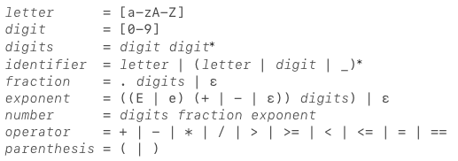

# simple_lexer
Simple Lexer in Rust

From [Hackernoon tutorial](https://medium.com/hackernoon/lexical-analysis-861b8bfe4cb0)

> Let’s consider a simple language for performing mathematical operations. The language supports the four basic arithmetic operators (+, -, * and /), comparison operators (>, ≥, <, ≤ and ==), and grouping using parenthesis. It also has basic support for variables and assignment using the = symbol.

Below are examples of valid instructions in our mini language.

```javascript
1 + 2
(5 - 4) + 7
12.34 * 5e-9
pi = 22 / 7
radius = 5
circle_circumference = 2 * pi * radius
```

## Lexical Grammar



## Parsing Grammar

```
Factor      = <number> | <identifier> | '(' RightExpr ')'
Term        = Factor '*' Factor
            = Factor '/' Factor
            = Factor
CompTerm    = Term '+' Term
            = Term '-' Term
            = Term
RightExpr   = CompTerm '==' CompTerm
            = CompTerm '<' CompTerm
            = CompTerm '<=' CompTerm
            = CompTerm '>' CompTerm
            = CompTerm '>=' CompTerm
            = CompTerm
Expr        = <identifier> '=' RightExpr
            = RightExpr
```

## Running

    $ cargo run -- "PI - 3"
    Lexer result:
    <Iden(PI), 0:0> <ArOp(-), 0:3> <Num(3), 0:5>

    Parser result:
    Root [0:0]>
     Substraction [0:3]>
      PI [0:0]
      3 [0:5]

    0.14159265358979312


Tests:

```bash
$ cargo test
```
